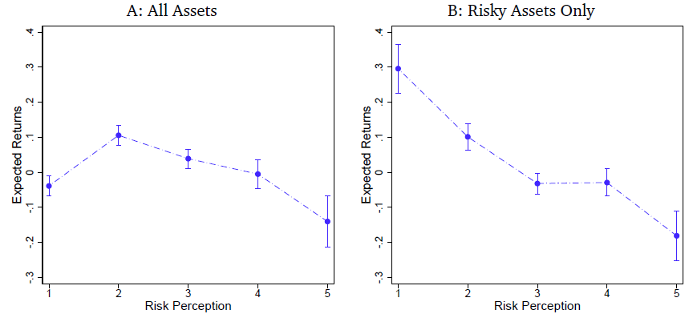

<strong>Publications</strong>

<a href = "https://doi.org/10.1287/mnsc.2023.4784"><strong>A One-Factor Model of Corporate Bond Premia</strong></a>

 with&nbsp;<a href = "https://discover.research.utoronto.ca/24652-redouane-elkamhi">Redouane Elkamhi</a> and&nbsp;<a href = "https://yoshionozawa.github.io/">Yoshio Nozawa</a>

<strong>Management Science</strong>, 2024, <a href = "https://services.informs.org/dataset/download.php?doi=mnsc.2023.4784">Data and code</a>, <a href = "https://papers.ssrn.com/sol3/papers.cfm?abstract_id=3669068">SSRN version</a>, <a href = "../assets/pdf/online_appendix/Elkamhi_Jo_Nozawa_MS_Internet_Appendix.pdf">Online Appendix</a>, <a href = "../assets/bibliography/elkamhi2023one.txt">[+ bibtex]</a>

Empirical asset pricing, Long-run risk, Wealthy households&#39; Consumption

	
Abstract 

A one-factor model based on long-run consumption growth explains the risk premiums on corporate bond portfolios sorted on credit rating, credit spreads, downside risk, idiosyncratic volatility, long-term reversals, maturity, and sensitivity to the financial intermediary capital factor. The estimated risk-aversion coefficient is lower when we use the consumption growth of wealthy households over a longer horizon as a risk factor, and a model with a 20-quarter horizon yields a risk-aversion coefficient of 15, a value similar to the one estimated from equity portfolios.

	
Key result 

  

&nbsp;

<a href = "https://doi.org/10.1017/S0022109023000807"><strong>Measuring &quot;State-level&quot; Economic Policy Uncertainty</strong></a>

with&nbsp;<a href = "https://discover.research.utoronto.ca/24652-redouane-elkamhi">Redouane Elkamhi</a> and&nbsp;<a href = "https://sites.google.com/view/marco-salerno">Marco Salerno</a>

<strong>Journal of Financial and Quantitative Analysis</strong>, 2024, <a href = "https://data.mendeley.com/public-files/datasets/bm3bn4r5d4/files/18f4ba70-0e3f-4b4d-9f79-69ab0dd07c69/file_downloaded">Data</a>, <a href = "https://papers.ssrn.com/sol3/papers.cfm?abstract_id=3695365">SSRN version</a>, <a href = "../assets/pdf/online_appendix/Elkamhi_Jo_Salerno_JFQA_Internet_Appendix.pdf">Online Appendix</a>, <a href = "../assets/bibliography/elkamhi2023measuring.txt">[+ bibtex]</a>

Economic uncertainty and applications to corporate finance&nbsp;&amp;&nbsp;asset pricing

	
Abstract 

We develop 50 indices of State-level Economic Policy Uncertainty (SEPU) based on newspaper coverage frequency using 204 million newspaper articles from March 1984 to December 2019. We assess the validity of our measures. Our SEPU indices vary counter-cyclically with respect to state-specific economic conditions, rise before close gubernatorial elections, and exhibit a large cross-sectional variation. We demonstrate that SEPU indices are associated with the cross-sectional variation in state-level GDP, employment, income as well as industry investment decisions. Our findings highlight the importance of economic policy uncertainty at the state level in addition to the nationwide level.

	
Key result 

  

&nbsp;

<a href = "https://academic.oup.com/rcfs/advance-article-abstract/doi/10.1093/rcfs/cfac019/6576649?redirectedFrom=fulltext"><strong>Agency Conflicts and Investment: Evidence from a Structural Estimation</strong></a>

with&nbsp;<a href = "https://discover.research.utoronto.ca/24652-redouane-elkamhi">Redouane Elkamhi</a>,&nbsp;<a href = "https://sites.google.com/view/danielsangkim/home">Daniel Kim</a>, and&nbsp;<a href = "https://sites.google.com/view/marco-salerno">Marco Salerno</a>

<strong>Review of Corporate Finance Studies</strong>,&nbsp;2024,&nbsp;<a href = "https://papers.ssrn.com/sol3/papers.cfm?abstract_id=3680008">SSRN version</a>, <a href = "../assets/bibliography/elkamhi2023agency.txt">[+ bibtex]</a>

Dynamic capital structure model

	
Abstract 

We develop a dynamic capital structure model to study how agency conflicts between managers and shareholders affect the joint determination of financing and investment decisions. We show that there are two agency conflicts with opposing effects on a manager’s choice of investment: first, the consumption of private benefits channel leads managers not only to choose a lower optimal leverage, but also to underinvest, and second, compensation linked to firm size may lead managers to overinvest. We fit the model to the data and show that the average firm slightly overinvests, younger CEOs invest more than older ones, while CEOs with longer tenure overinvest more than CEOs with shorter tenure.

&nbsp;

<a href = "https://www.sciencedirect.com/science/article/pii/S0304405X23000624"><strong>Asset holders' Consumption Risk and Tests of Conditional CCAPM</strong></a>

with&nbsp;<a href = "https://discover.research.utoronto.ca/24652-redouane-elkamhi">Redouane Elkamhi</a>

<strong>Journal of Financial Economics</strong>, 2023, <a href = "https://data.mendeley.com/public-files/datasets/64sr8nwn64/files/4f1a0130-914a-4561-8e9d-42e112b3732a/file_downloaded">Data and code</a>, <a href = "https://papers.ssrn.com/sol3/papers.cfm?abstract_id=3349844">SSRN version</a>, <a href = "../assets/pdf/online_appendix/Elkamhi_Jo_JFE_Internet_Appendix.pdf">Online Appendix</a>, <a href = "../assets/bibliography/elkamhi2023asset.txt">[+ bibtex]</a>

Empirical asset pricing,&nbsp;Asset holders&#39;&nbsp;Consumption,&nbsp;Conditional tests

	
Abstract 

We test the conditional consumption-CAPM using asset holders' consumption and find that the time variation in the prices of asset holders' consumption risk is procyclical. This puzzling time variation is at odds with the implication of existing consumption-based equilibrium asset pricing models. We show that our finding is a salient feature of the data observed in multiple asset classes (aggregate equity market, equity portfolios, bond portfolios, and commodities portfolios), using different measures of consumption (household survey data and high-frequency retail shopping data) and alternative empirical methodologies.

	
Key result 

  

&nbsp;

&nbsp;

<strong>Working Papers</strong>

<a href = "https://papers.ssrn.com/sol3/papers.cfm?abstract_id=4096443"><strong>Subjective Risk-Return Trade-off</strong></a>

 with&nbsp;<a href = "https://www.hkubs.hku.hk/people/chen-lin/">Chen Lin</a> and&nbsp;<a href = "https://yangyou1.weebly.com/">Yang You</a>, submitted
 
Presentation: MFA (2024), SNU (2023), Korea University (2023), KAIST (2023), &nbsp;Colorado Finance Summit&nbsp;(2022),&nbsp;NUS Risk Management conference (2022), CUHK (2022), Hong Kong Joint Finance Research Workshop (2022)

Media coverage:&nbsp;<a href = "https://www.marketwatch.com/story/most-investors-still-dont-understand-the-relationship-between-risk-and-return-study-reveals-11659104629">MarketWatch</a>

Household finance, Subjective expectation, Asset pricing, <a href = "../assets/bibliography/jo2024subjective.txt">[+ bibtex]</a>

 
 Abstract  

We survey 2,548 representative U.S. respondents to estimate subjective risk-return trade-offs across savings, government bonds, stocks, real estate, gold, and cryptocurrencies. We document robust negative relationships between perceptions of risk and return among risky assets, which are observed even among financially literate respondents. Strong asset-specific sentiments, reflected in large deviations of return perceptions from average perceptions, drive these significant negative risk-return trade-offs. Both strong optimism and pessimism contribute to negative risk-return trade-offs with similar magnitudes. These negative risk-return trade-offs translate into under-diversified portfolios, as investors avoid assets they perceive to generate low returns and high risk.

	
Key result 

  

&nbsp;

<a href = "https://papers.ssrn.com/sol3/papers.cfm?abstract_id=5103141"><strong>Do Minority Neighborhoods Pay More for Affordable Housing Finance?</strong></a>

with&nbsp;<a href = "https://www.bschool.cuhk.edu.hk/staff/ahn-changhyun/">Changhyun Ahn</a>, submitted 

Presentation: Fostering Inclusion: A Workshop to Advance Research on Diversity, Equity, and Inclusion at the University of Washington Foster School of Business (2024)

Affordable housing, Multi-family housing, Municipal bonds, Racial disparities, and Racial segregation, <a href = "../assets/bibliography/ahn2025minority.txt">[+ bibtex]</a>

	
 Abstract 

State and local governments issue tax-exempt bonds to finance developments of affordable multi-family rental housing. These bonds represent a crucial funding source for addressing the U.S. affordable housing crisis. We find that affordable housing projects in predominantly minority neighborhoods face significantly higher borrowing costs than those in predominantly white neighborhoods. This disparity persists even among FHA-insured bonds where credit risk is essentially eliminated through federal guarantees. The effect is stronger when project neighborhoods have a higher minority concentration compared to surrounding areas, suggesting that financing costs may incentivize development in racially homogeneous communities, potentially reinforcing existing patterns of racial segregation.

 

&nbsp;

<a href = "https://papers.ssrn.com/sol3/papers.cfm?abstract_id=4163869"><strong>Safe Jobs, Risky Investments: Employment Protection and Household Portfolio Choices</strong></a>

with <a href = "https://www.bschool.cuhk.edu.hk/staff/ahn-changhyun/">Changhyun Ahn</a> and <a href = "https://www.singsenlam.com/">Singsen Lam</a>

Presentation: The 18th NYCU International Finance Conference (2024, scheduled), Indian School of Business (2024), NTU (2024), FMA Asia/Pacific (2024), Labor and Finance Conference (2023), UNSW (2023), UYSD (2023), UTS (2023), SIPP Virtual Conference (2023), EFA (2020), NFA (2020), MFA (2020), SFA (2020), SWFA (2020), University of Toronto (2020), CUHK (2020)

<em>FMA Asia/Pacific Best Paper Award (Asset pricing/Investment) (2024), Shinhan Bank & KAFA Best Paper Award (2023)</em>

Household finance, Stock market participation, and Labor finance, <a href = "../assets/pdf/online_appendix/Jo_Internet_Appendix.pdf">Online Appendix</a>, <a href = "../assets/bibliography/jo2023unintended.txt">[+ bibtex]</a>

 
 Abstract  

By leveraging US state-level employment protection laws, we provide evidence that such laws increase stock market participation, on both intensive and extensive margins. Young, low-income, low-wealth, and less-educated households exhibit stronger effects. Conversely, when the protection law is reversed, we observe the opposite risk-taking behaviors. Our findings remain robust across various stock market participation measures, datasets, and stacked difference-in-differences research design, underscoring the significance of employment protection in encouraging households to take financial risks, and potentially enhancing wealth accumulation. This represents a novel economic channel through which employment protection can benefit households.

 

&nbsp;

<a href = "https://papers.ssrn.com/sol3/papers.cfm?abstract_id=4056360"><strong>Climate Change and Households&#39; Risk-Taking</strong></a>

with&nbsp;<a href = "https://sites.google.com/site/gao515515/">Zhenyu Gao</a> and&nbsp;<a href = "https://www.singsenlam.com/">Singsen Lam</a> &nbsp; 

Presentation: Finance Down Under (2025, scheduled), SBFC (2024, scheduled), CICF (2024), CFRC (2024), SGFIN Annual Research Conference on Sustainability (2024), KAFA-KFMA-KAFE (2023), SIPP Virtual Conference (2023), AFBC (2022), KAFA (2022), CUHK (2022), NTHU Symposium on Sustainable Finance and Economics (2022)

Household finance, Stock market participation, and&nbsp;Climate finance,  <a href = "../assets/bibliography/gao2022climate.txt">[+ bibtex]</a>

	
 Abstract 

This paper studies a novel channel through which climate risks affect households&rsquo; choices of risky asset allocation: a stringent climate change regulation elevates labor income risk for households employed by high-emission industries which in turn discourages households&#39; financial risk-taking. Using staggered adoptions of climate change action plans across states, we find that climate change action plans lead to a reduction in the share of risky assets by 15% for households in high-emission industries. We also find a reduction in risky asset holdings after the stringent EPA regulation. These results are stronger with experiences of climate change-related disasters. Our study implies an unintended consequence of climate regulations for wealth inequality by discouraging low-wealth households&#39; financial risk-taking.

 

&nbsp;

<strong>Spouses in The Same Boat: Intra-Household Risk-Sharing and Financial Risk-Taking</strong>

with&nbsp;<a href = "https://sites.google.com/site/gao515515/">Zhenyu Gao</a> and&nbsp;<a href = "https://www.singsenlam.com/">Singsen Lam</a> &nbsp; 

Presentation: AsianFA Annual Meeting (2024), Singapore Rising Scholars Conference (2024), Central University of Finance and Economics (2024), AFA PhD Poster Session (2024), FMA Doctoral Consortium (2023), CUHK (2023)

Household finance, Stock market participation, and Intra-household risk-sharing

	
 Abstract 

This paper proposes a novel channel for households' risky asset allocation: better intra-household risk-sharing reduces overall labor income risk for dual-earner couples, thus encouraging households' financial risk-taking. Capturing intra-household risk-sharing dynamics using the conditional income correlation between spouses' industries, we find that better income risk-sharing within couples increases households' financial risk-taking. Exploiting unexpected events of spousal death, we causally identify the impact of intra-household risk-sharing on households' asset choices. Our study implies an unintended consequence of positive assortative mating, a growing tendency of couples choosing partners with similar socioeconomic statuses, which limits risk-sharing between spouses, thereby discouraging financial risk-taking.

 

&nbsp;

<strong>Is Greenium a Reflection of Inflation Risk?</strong>

with&nbsp;Zhenyu Gao and Yuyi He 

Presentation: SBFC (2024, scheduled), LU-JNU Joint Conference for Sustainable Finance and Development in the Digital Era (2024),  CUHK (2024), KFA Autumn Conference (2024)  

<em>Best Paper Award, Korean Finance Association Autumn Conference (2024)</em>

Greenium, Inflation, and Asset Pricing 

 
 Abstract  

We present a novel stylized fact that green stocks carry higher inflation risk compared to brown stocks, performing poorly at times of unexpected inflation. Given this fact, can the outperformance of green stocks over brown stocks (the "greenium") be explained as compensation for inflation risk? We find that the magnitude of the greenium decreases by 31% and 54% for Scope 1 and Scope 2, and the greenium becomes statistically insignificant after controlling for individual stocks' core inflation risk exposure. These findings are robust to excluding brown industries and are not driven by the post-COVID inflationary period. Overall, our results suggest that the greenium is in part a reflection of inflation risk compensation. 

&nbsp;

<a href = "https://papers.ssrn.com/sol3/papers.cfm?abstract_id=5055695"><strong>Data Scientists on Wall Street</strong></a>

with&nbsp;<a href = "https://sites.google.com/site/cenling/">Ling Cen</a>, <a href = "https://discover.research.utoronto.ca/21924-bing-han">Bing Han</a>, and <a href = "https://sites.google.com/view/yanruhan/">Yanru Han</a> 

Presentation: SKKU (2024, scheduled), Yonsei University (2024)

Institutions, Data Scientists, and Stock Price Informativeness, <a href = "../assets/bibliography/cen2024data.txt">[+ bibtex]</a>

	
Abstract 

Financial institutions have significantly increased their recruitment of data scientists in the last two decades. We find that the number of data scientists employed by financial institutions causally affects their ability to earn abnormal profits. Data scientists' ability to generate abnormal profits on a stock is positively correlated to the concentration of data scientists across all institutional investors holding the stock. Institutional investors strategically adjust portfolio allocation and recruitment decisions to maximize the benefits generated by their data scientists. Consistent with the notion that the competition among data scientists speeds up the production and trade of private information, we also show that the concentration of data scientists covering a stock reduces its price informativeness in the capital market.

&nbsp;

<strong>Echoes of Inflation: CEO Early-life Inflation Experience, Inflation Attention, and Corporate Decisions</strong>

with&nbsp;<a href = "https://leeds-faculty.colorado.edu/garcia/">Diego Garcia</a>, <a href = "https://www.mikejshin.com/">Michael Shin</a>, and <a href = "https://grad.bschool.cuhk.edu.hk/students/wu-siyuan/">Siyuan Wu</a> 

Presentation: CU Boulder (2024), KAIST (2024), CUHK (2024), U of Sydney (2024), UTS (2024), Monash Winter Finance (2024), Sydney Macroeconomics Reading Group Workshop (2024), Korea-Japan Finance Workshop (2024) 

Inflation, Experience, Attention, and Corporate Decisions

 
 Abstract  

We develop a firm-level inflation attention measure using earnings calls from 2002-2023.  Our identification strategy exploits CEO childhood experiences during the Great Inflation to capture exogenous variation in attention. We find that 1960s-born CEOs pay more attention to inflation than other cohorts. Attentive CEOs adopt cautious policies –- holding more cash, investing less, hiring less, and using less leverage. Moreover, they tend to raise output prices and exhibit higher equity valuations. Our results are robust to excluding the COVID-19 period. Our analysis highlights how CEO experience and attention shape corporate decisions and performance in response to the macroeconomic environment. 

&nbsp;

<strong>Local Grocery Basket Inflation and Institutional Investors' Portfolio Choices</strong>

with&nbsp;<a href = "https://www.polyu.edu.hk/af/bkang/">Byoung Uk Kang</a> and <a href = "https://cuhk.converis.clarivate.com/converis/portal/detail/Person/186619902?auxfun=&lang=zh_HK">Zhecheng Luo</a> 

Presentation: CUHK (2023)

Inflation and Institutions

&nbsp;

<a href = "https://papers.ssrn.com/sol3/papers.cfm?abstract_id=3349840"><strong>The Composition of Market Participants and Asset dynamics</strong></a>

Presentation: &nbsp;SFS Cavalcade (2021), RCFS/RAPS Winter Conference (2020), EFA (2019), CICF (2019), APAD (2019), EFMA (2019), ABFER, CEPR and CUHK (2019), SFS Cavalcade Asia (2018), NFA (2018), FMA (2018), YES (2018), TADC (2018), AFM (2017), AFBC (2017), Indiana University (2017)&nbsp;

Theoretical asset pricing and stock market participation,  <a href = "../assets/bibliography/jo2022composition.txt">[+ bibtex]</a>

 
 Abstract  

We develop a dynamic equilibrium model where heterogeneous investors endogenously choose to enter/exit the stock market. We characterize the equilibrium and present a conditional consumption&nbsp;CAPM. The model implies small changes in the composition of stockholders, which generate a strongly countercyclical stockholders&rsquo; amount of consumption risk. The model provides a new perspective on the main drivers of asset dynamics. It is the procyclical consumption risk-sharing implied by changes in stockholders&#39; composition that contribute to the dynamics of risk premium, excess volatility, and price-dividend ratio. We provide empirical evidence on market participation, amount of risk, and price of risk, supporting our theory. 

&nbsp;

&nbsp;

<strong>Other Publications</strong>

<a href = "https://www.sciencedirect.com/science/article/pii/S0927538X20304510"><strong>Chinese Economic Policy Uncertainty and U.S. Households&#39; Portfolio Decisions</strong></a>

 with&nbsp;<a href = "https://gsias.hufs.ac.kr/gsias/7178/subview.do?enc=Zm5jdDF8QEB8JTJGcHJvZmwlMkZnc2lhcyUyRjMzOCUyRjM4OTElMkZhcnRjbFZpZXcuZG8lM0ZwYWdlJTNEMSUyNnNyY2hDb2x1bW4lM0QlMjZzcmNoV3JkJTNEJTI2">Kiryoung Lee</a> and&nbsp;<a href = "https://experts.mcmaster.ca/display/jeony5">Yoontae Jeon</a>

<strong>Pacific-Basin Finance Journal</strong>, Volume 64, 2020, <a href = "../assets/bibliography/lee2020chinese.txt">[+ bibtex]</a>

Economic Uncertainty, Household Finance, Stock Market Participation, and Chinese Economy 

	
Abstract 

We find that U.S. households reduce their exposure to the stock market in response to an increase in the economic policy uncertainty (EPU) of not only U.S., but also to an increase in the Chinese EPU. We identify income uncertainty as a key driver of this relationship. In response to an increase in the Chinese EPU, households whose jobs belong to the industries that heavily export to China react more sensitively by lowering their stock shares in financial wealth. Moreover, the response is stronger for households in states that export to China more than other states. This evidence suggests that U.S. households respond to the Chinese EPU because an increase in the Chinese EPU potentially increases their income uncertainty. Our findings provide the first evidence on the importance of considering foreign economic policy uncertainty in explaining households' portfolio decisions.

